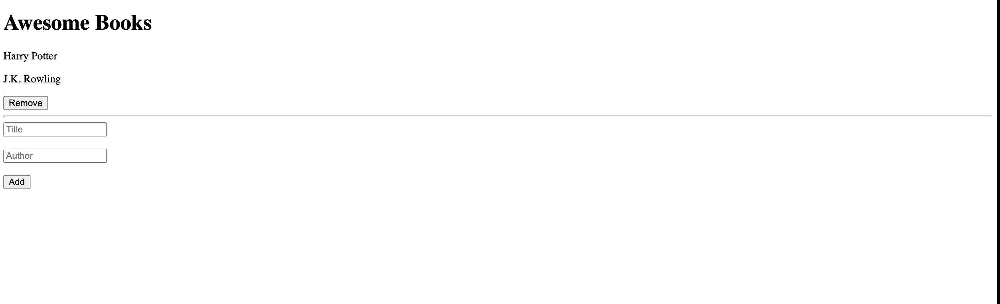

# Awesome Books

> Book Store using JavaScript

Additional description about the project and its features.

## Built With

- HTML/CSS
- JavaScript
- Live Server

## Live Demo

[Live Demo Link](https://bereketretta.github.io/Awesome_Books/)

## Getting Started

To get a local copy up and running follow these simple example steps.

### Prerequisites

git clone repo: `git clone https://github.com/BereketRetta/Awesome_Books.git`

then `cd Awesome_Books`

### Install

run `npm install` to install dependencies

## Authors

👤 **Author1**

- GitHub: [@bereketRetta](https://github.com/bereketRetta)
- Twitter: [@bereketRetta](https://twitter.com/bekiopia)
- LinkedIn: [bereketRetta](https://linkedin.com/in/bereket-retta)

👤 **Author2**

- GitHub: [@olawalecoder](https://github.com/olawalecoder)
- Twitter: [@olawalecoder](https://twitter.com/olawalecoder)
- LinkedIn: [LinkedIn](https://linkedin.com/in/bamidele-olawale-072975142)

👤 **Author3**

- Github: [@Yerimah](https://github.com/Yerimah)
- Twitter: [@iamdeewyne](https://twitter.com/iamdeewyne)
- LinkedIn: [LinkedIn](https://www.linkedin.com/in/daniel-yerimah/)

## 🤝 Contributing

Contributions, issues, and feature requests are welcome!

Feel free to check the [issues page](https://github.com/BereketRetta/Awesome_Books/issues).

## Show your support

Give a ⭐️ if you like this project!

## Acknowledgments

- Microverse

## 📝 License

This project is [MIT](./MIT.md) licensed.
